# Base Database Structure

## Requests

### Write Request

#### General Overview

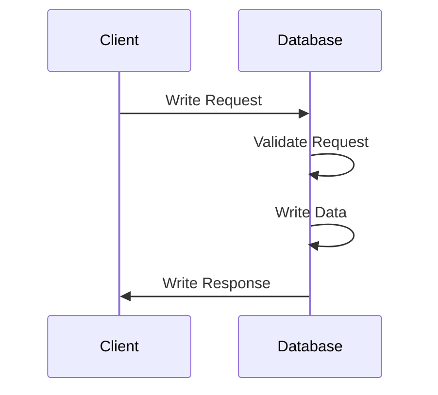

#### Detailed Overview

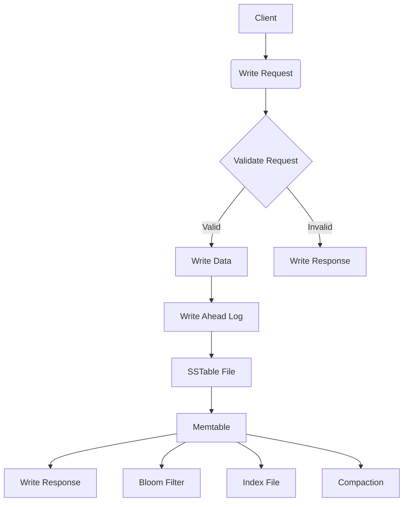

### Read Request

#### General Overview

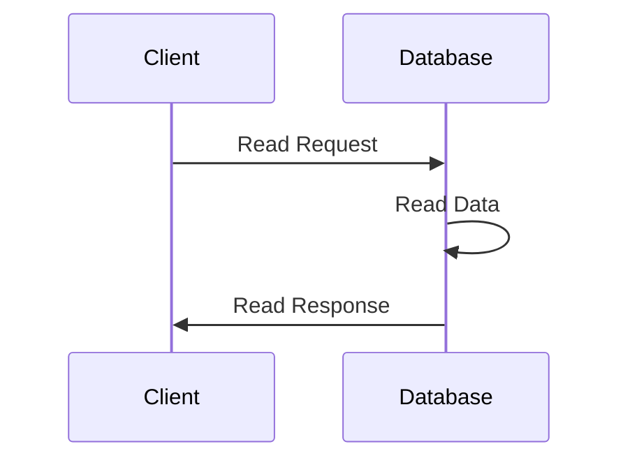

#### Detailed Overview

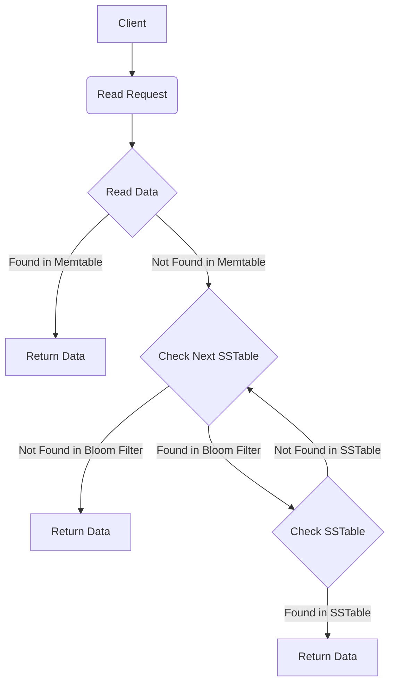

### Delete Request

#### General Overview


#### Detailed Overview

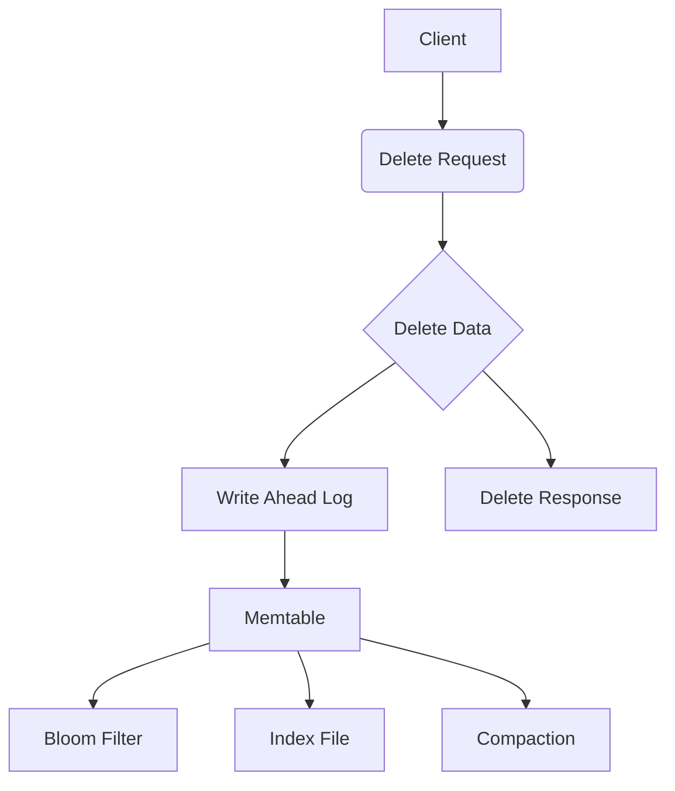

### Update Request

#### General Overview

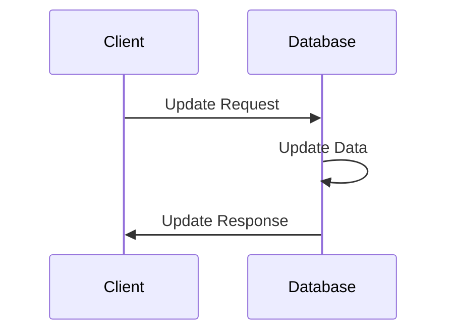

#### Detailed Overview

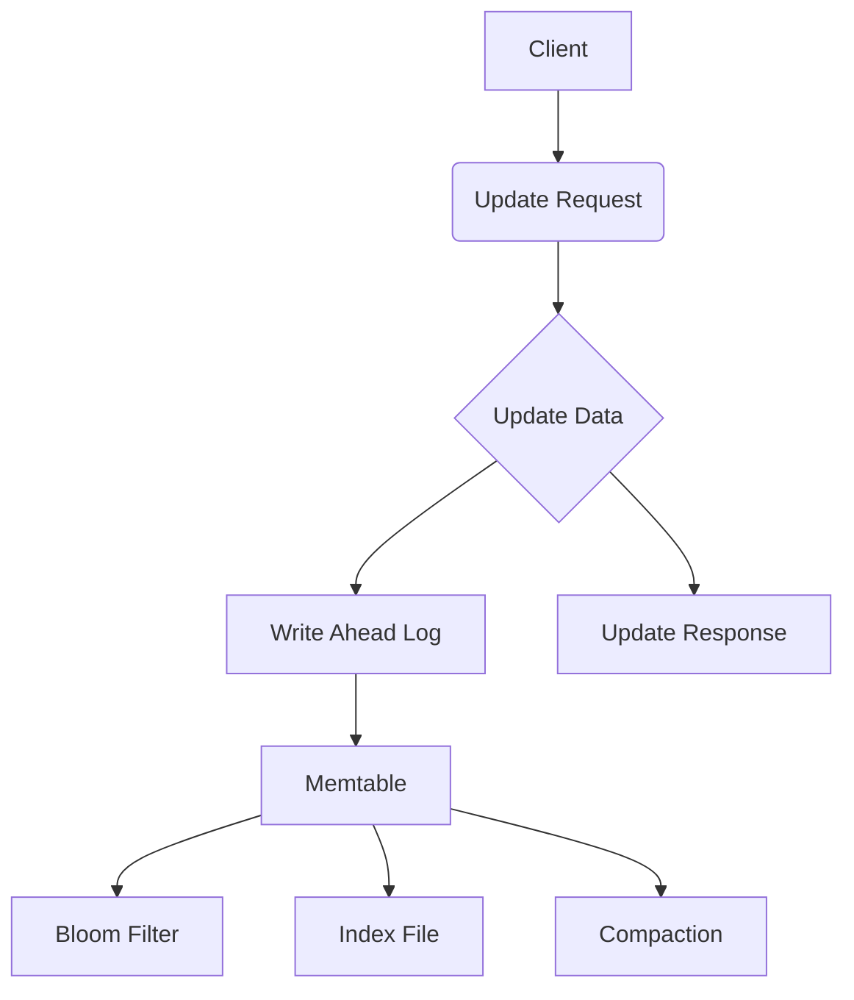

## File Structure

### SSTable File

#### General Overview

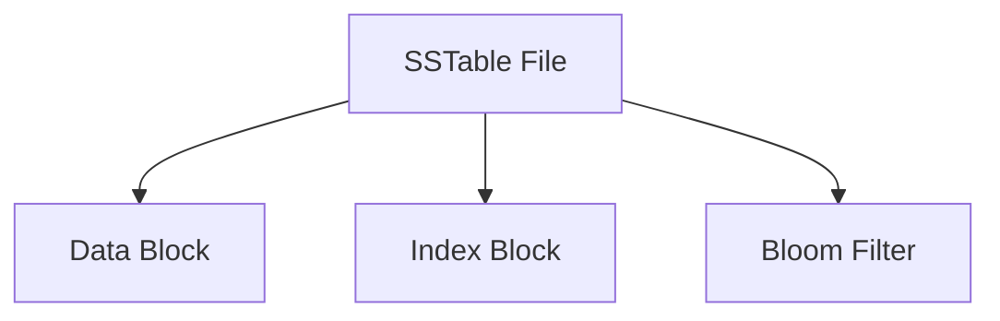

#### Detailed Overview

the file will consist of 3 blocks:

- Data Block: Contains the actual data
- Index Block: Contains the index of the data
- Bloom Filter: Contains the bloom filter of the data

Data block will be stored in the form of:

```plaintext
   Header Length (1 bytes)       
| Header                        |
| +---------------------------+ |
| | Magic Number (4 bytes)    | |
| | Version Flag (1 byte)     | |
| | Compression Flag (1 byte) | |
| | Encoding Flag (1 byte)    | |
| +---------------------------+ |
Metadata Length (1 bytes)
| Metadata                     |
| +---------------------------+ |
| | Value Data Type (1 byte) | |
| | Key Data Type (1 byte)   | |
| | KVPair Length (1 byte)   | |
| +---------------------------+ |
| | KV Pair (Amount -> KvCount) ||
```

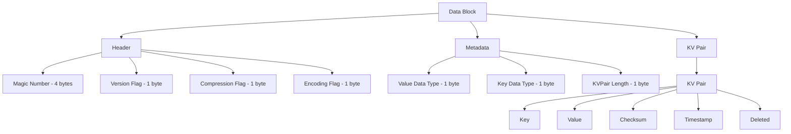

- and data format will be stored in the form of:
  
```plaintext
STARTDELIMITER (4 bytes ) | key length (4 bytes) | value length (4 bytes) | key (key length) | value (value length) | timestamp (8 bytes) | deleted (1 byte) | ENDDELIMITER (4 bytes) | (repeat for KVS_PER_PAGE times)
```

| Field | Length | Description |
| --- | --- | --- |
| STARTDELIMITER | 4 bytes | Start of the data block |
| key length | 4 bytes | Length of the key |
| value length | 4 bytes | Length of the value |
| checksum length | 4 bytes | Length of the checksum |
| key | key length | Key of the data |
| value | value length | Value of the data |
| checksum | 4 bytes | Checksum of the data |
| timestamp | 8 bytes | Timestamp of the data |

### Log File

#### General Overview

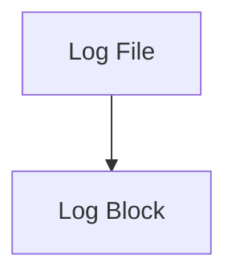

#### Detailed Overview

the file will consist of 1 block:

- Log Block: Contains the log data
- Log block will be stored in the form of:

```plaintext
   Header Length (1 bytes)
| Header                        |
| +---------------------------+ |
| | Magic Number (4 bytes)    | |
| +---------------------------+ |
| Logs                          |
| +---------------------------+ |
| | Log Data (Amount -> LogCount) ||
```

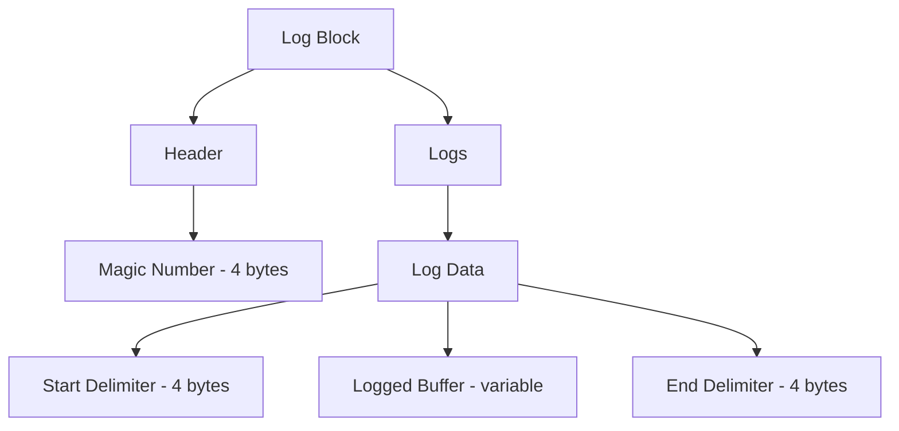

- and data format will be stored in the form of:

```plaintext
STARTDELIMITER (4 bytes ) | logged buffer (variable) | ENDDELIMITER (4 bytes )
```

| Field | Length | Description |
| --- | --- | --- |
| STARTDELIMITER | 4 bytes | Start of the log block |
| logged buffer | variable | Logged buffer |
| ENDDELIMITER | 4 bytes | End of the log block |
